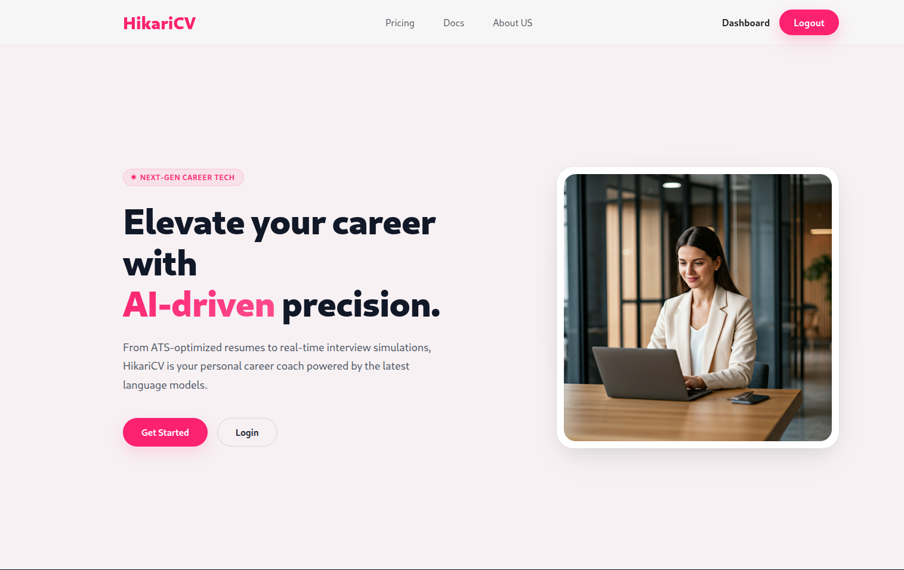
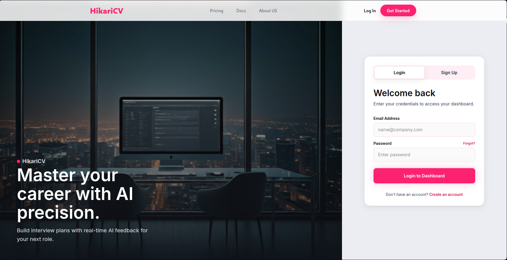
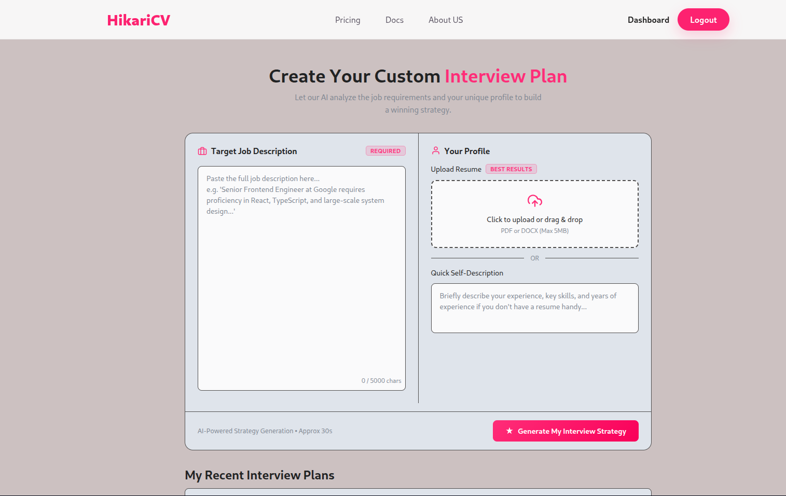
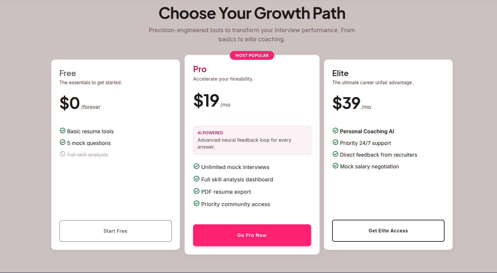

# 🌌 HikariCV (InterviewAI) — AI-Driven Career Tech Platform

[](https://react.dev/)
[](https://nodejs.org/)
[](https://www.mongodb.com/)
[](https://deepmind.google/technologies/gemini/)
[](https://vite.dev/)

> **Elevate your career with AI-driven precision.** HikariCV is a next-generation, full-stack career platform that analyzes job requirements and user profiles using advanced LLMs to generate personalized preparation roadmaps, tailor ATS-optimized resumes, and compile PDF applications on-the-fly.

---

## 🎨 Visual Showcase & User Journey

Here is the interface and flow of HikariCV, designed with a premium, minimalist light-themed visual design:

### 🏠 Landing Page
A modern UI featuring glassmorphism, responsive bento grids, and smooth animations highlighting our AI capability.


### 🔑 Security & Authentication
Secure entry points featuring email verification, rate limiting, and password recovery.


### 📊 Interview Prep & Strategy Dashboard
Users specify a target job description and upload a resume (PDF) or type a self-description to generate a customized strategy.


### 💎 Pricing Model
Transparent, flexible pricing models integrated with the landing page design system.


---

## 🚀 Key Features

### 🔍 1. Personal Interview Planner & Analyzer
*   **Job Description Matching:** Compares user resume context against target job descriptions.
*   **AI Match Score:** Gives a real-time matching indicator (0-100%) highlighting candidate readiness.
*   **Skill Gaps Analysis:** Pinpoints critical competencies missing from the candidate's profile, categorized by severity (High/Medium/Low).

### 🤖 2. Custom Mock Interview Simulation
*   **Structured Technical & Behavioral Questions:** Generates interview questions tailored to the position and your resume.
*   **Interviewer Intention Insights:** Demystifies *why* a specific question is asked, giving candidates a strategic advantage.
*   **Model Answers:** Provides comprehensive model answers and recommended structures (like the STAR method).

### 📅 3. Multi-Day Preparation Roadmaps
*   **Structured Timelines:** Generates day-by-day tasks based on the candidate's preparation time window.
*   **Guided Action Items:** Contains study tasks, practice prompts, and focus areas to bridge skill gaps.

### 📄 4. ATS-Optimized Resume Tailoring & PDF Export
*   **Contextual Refinement:** Instructs Gemini to rewrite the candidate's resume, aligning accomplishments with the target job keywords.
*   **Server-Side Compilation:** Leverages a headless browser (**Puppeteer**) to generate an elegant A4 PDF layout based on tailored HTML resume styles.

---

## 🛠️ Advanced Tech Stack & Architecture

This repository showcases a professional, decoupled Client-Server architecture utilizing modern web standards.

### Frontend (Client)
*   **React 19 (Vite):** Utilizes React 19's fast runtime and HMR capabilities.
*   **Router v7:** Employs nested layouts, protected route guards, and clean path routing.
*   **SASS (SCSS):** Structured style modules separating components, layout rules, and variables.
*   **Framer Motion:** High-performance, micro-interactive transitions for key UI sections.
*   **SEO Optimization:** Fully optimized pages using `react-helmet-async` for JSON-LD schemas, meta tagging, and dynamic titles.

### Backend (Server)
*   **Node.js & Express:** Modern RESTful API utilizing MVC structure.
*   **Mongoose (MongoDB):** Dynamic document schemas for user profiles, blacklist tokens, and multi-layered interview reports.
*   **Google Gemini SDK (`@google/genai`):** Integrates structured schemas with Zod to enforce reliable JSON outputs from the LLM.
*   **Puppeteer:** Headless browser PDF engine running on the backend to render tailored A4 print outputs.
*   **Robust Security:**
    *   **JWT Auth in Secure HTTP-Only Cookies:** Keeps tokens shielded from XSS.
    *   **Token Blacklisting:** Handles secure user logouts.
    *   **Bcrypt.js Hashing:** Secure credential storage.
    *   **Express Rate Limiter:** Protects API endpoints from abuse.
    *   **Email Verification & Recovery:** Fully automated mail service templates.

---

## 📁 Repository Structure

```bash
├── Backend
│   ├── src
│   │   ├── config          # DB and system connections
│   │   ├── controllers     # HTTP Route handlers
│   │   ├── middlewares     # Rate limiters, file uploads (Multer), JWT verification
│   │   ├── models          # MongoDB schemas (User, InterviewReport, Blacklist)
│   │   ├── routes          # API endpoints (/api/auth, /api/interview)
│   │   ├── services        # Gemini GenAI, Puppeteer PDF generation
│   │   └── app.js          # Express app initialization
│   ├── server.js           # Server entrypoint
│   └── package.json
│
└── Frontend
    ├── src
    │   ├── components      # Global layout, UI elements, loaders, and Navbar
    │   ├── features
    │   │   ├── auth        # Auth pages (Login, Register, Password Reset) & hooks
    │   │   ├── interview   # Dashboard, Report pages, and preparation hooks
    │   │   └── landing     # Landing pages (Pricing, About, Docs, Home)
    │   ├── seo             # SEO controllers & structured JSON-LD data
    │   ├── app.routes.jsx  # React Router v7 routes configuration
    │   └── main.jsx        # Frontend entrypoint
    ├── public              # Static assets, including Readme screenshots
    └── package.json
```

---

## ⚙️ Local Development Setup

To run this project locally, make sure you have **Node.js (v18+)** and **MongoDB** installed.

### 1. Setup Backend
1. Navigate to the `Backend` directory:
   ```bash
   cd Backend
   ```
2. Install dependencies:
   ```bash
   npm install
   ```
3. Create a `.env` file in the `Backend` directory with the following variables:
   ```env
   PORT=5000
   MONGO_URI=mongodb://localhost:27017/hikaricv
   JWT_SECRET=your_super_secret_jwt_key
   FRONTEND_URL=http://localhost:5173
   GOOGLE_GENAI_API_KEY=your_gemini_api_key
   # Email Config (Nodemailer / Resend)
   RESEND_API_KEY=your_resend_api_key
   EMAIL_FROM=noreply@hikaricv.com
   ```
4. Start the backend development server:
   ```bash
   npm run dev
   ```

### 2. Setup Frontend
1. Navigate to the `Frontend` directory:
   ```bash
   cd ../Frontend
   ```
2. Install dependencies:
   ```bash
   npm install
   ```
3. Create a `.env` file in the `Frontend` directory:
   ```env
   VITE_API_URL=http://localhost:5000
   ```
4. Start the frontend Vite server:
   ```bash
   npm run dev
   ```
5. Open your browser and navigate to `http://localhost:5173`.

---

## 💡 Developer Value
*   **Clean Code & Architecture:** Decoupled frontend features allow easy scaling. The backend follows classic MVC separation, ensuring clean controllers, middlewares, and services.
*   **Production-Ready AI Integrations:** Employs structural Gemini schemas, avoiding prompt injection issues and output variability by utilizing hard-typed JSON responses.
*   **Performance & Security Mindset:** Integrates HTTP-only cookie JWT controls, CORS verification, rate-limiting, secure file parsing buffers, and lightweight frontend assets.

---
*Created with 💙 by a developer passionate about building high-quality, modern web applications.*
